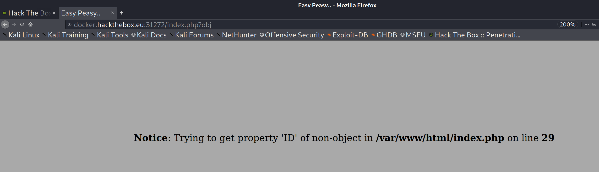
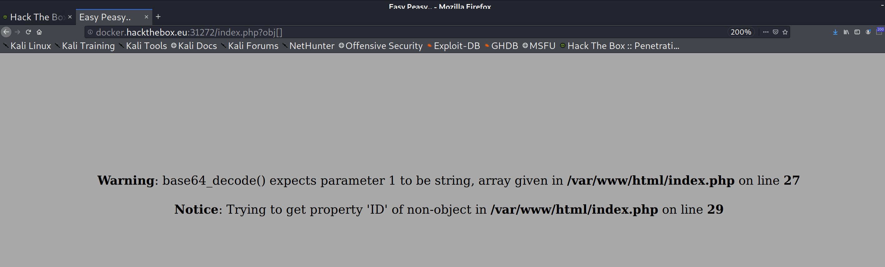

Command:
wfuzz -w /usr/share/dirb/wordlists/common.txt http://docker.hackthebox.eu:31272/index.php?FUZZ=test

- Discovered that the string "obj" was a valid match
- Put "obj" at the end of the url and that cleared the first error

- Messed with the url and finally discovered that adding brackets after "obj" gave me the following error:

