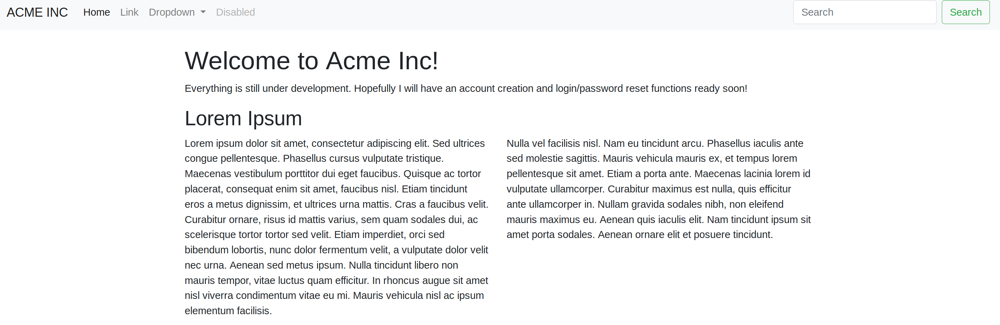
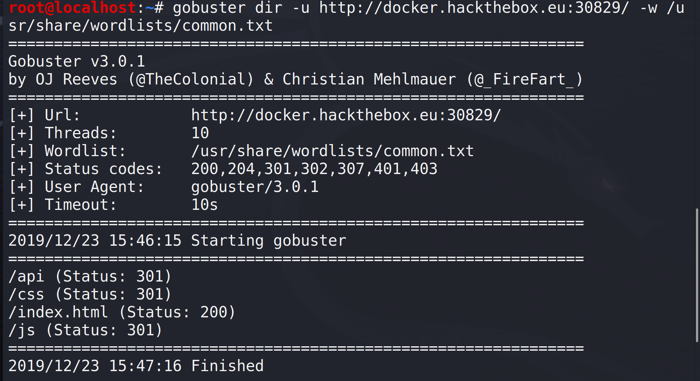
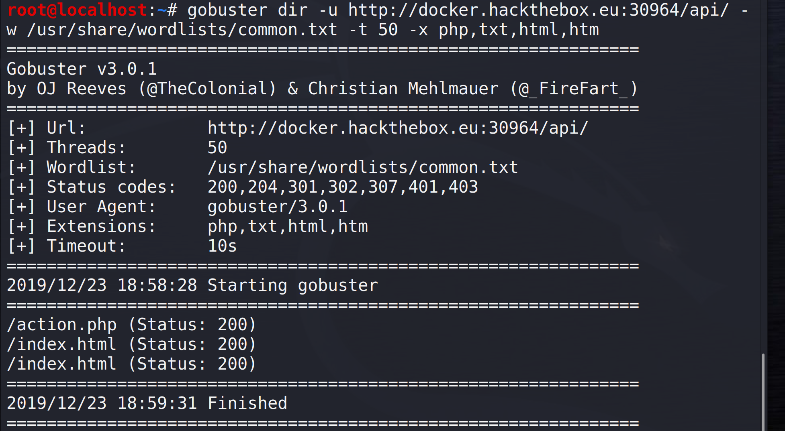

## Fuzzy
Objective: We have gained access to some infrastructure which we believe is connected to the internal network of our target. We need you to help obtain the administrator password for the website they are currently developing. 

## Tools
gobuster : Gobuster is a tool used to brute-force URIs (directories and files) in web sites.
wfuzz : Wfuzz is a tool designed for bruteforcing Web Applications.  Can work on Get/Post and form parameters.
Burp Suite CE

## Walkthrough
 - First, visited the website homepage to see if anything stood out right away.  The webpage clearly states that it is working on adding additional functionality.  

 - Used 'gobuster' in Kali to try and enumerate names of hidden directories within the website.   
  Command: 'gobuster dir -u http://<i></i>hackthebox.eu:30829/ -w /usr/share/wordlists/common.txt'    
 -dir (Directory mode)   
  -u url   
  -w path to desired word list for brute forcing   
 
 
 
 - In the output, we can see that gobuster discovered an interesting directory titled "api."  In computing, we know an API (Applicaton Programming Interface) lists many operations that developers can use, along with a description of what they do.  It is a set of definitions and protocols for building and integrating application software.  The homepage of the website also announces that that developers are currently working on login functionality and a password reset tool. We can use gobuster on this directory again and see what we find.   
   
   Command: gobuster dir -u http://<i></i>hackthebox.eu:30964/api/ -w /usr/share/wordlists/common.txt -t 50 -x php,txt,html,htm  
   *Note: -t 50 (50 threads increases speed) | -x adds file types to search for
   
 
 
 - Used wfuzz to brute force the action parameter it requires

Command: wfuzz --hh=24 -c -w /usr/share/dirb/wordlists/big.txt http://<i></i>docker.hackthebox.eu:30964/api/action.php?FUZZ=test  
--hh filters character length in the source code 
-c outputs findings in colors 
-w denotes the word list to use 
-FUZZ is the keyword that will be modified by words from our wordlist 

*Pic

Command: wfuzz --hh=24 -c -w /usr/share/dirb/wordlists/big.txt http://<i></i>docker.hackthebox.eu:30964/api/action.php?reset=FUZZ  

After running the command above, the output showed all 20,000+ responses.  I realized I had the character length wrong.  After viewing failed responses in Burp Suite, the content length for those failed responses was actually 27 characters, not 24.  Re-ran the command with --hh=27 to hide failed responses.  Also tried the "--filter" option to do the same thing. 

Command : wfuzz --hh=27 -c -w /usr/share/dirb/wordlists/big.txt http://<i></i>docker.hackthebox.eu:30964/api/action.php?reset=FUZZ  
OR  
Command : wfuzz --filter "c=200 and w!=5" -c -w /usr/share/dirb/wordlists/big.txt http://<i></i>docker.hackthebox.eu:30964/api/action.php?reset=FUZZ  

*Pic
 
 - Now that we have identified a valid 'Account ID' of '20', we can put that into the URL and see what we get.
 
 *Pic

 
 
 
 
 
 
 
 
 

