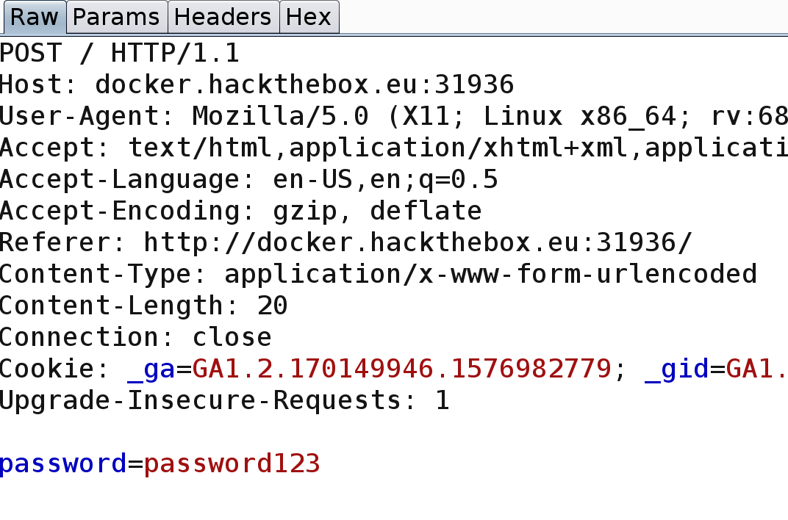
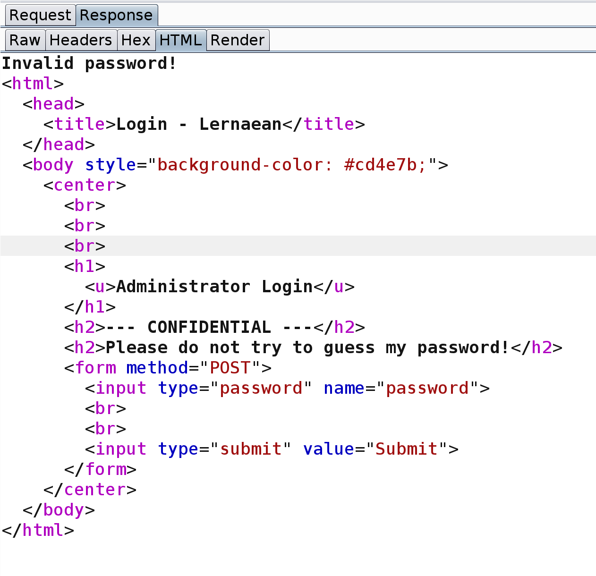
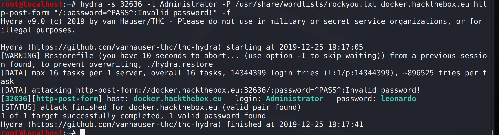

# Objective: 
Your target is not very good with computers. Try and guess their password to see if they may be hiding anything!

# Walkthrough

 - First looked at the website to see if there was anything that immediately stood out.  Inspected the page source using "Inspect Element" in the browser.  Noticed the form for submitting passwords into the page.  Tried a random password and captured the request and the response using Burp Suite.  
 
### Request:

### Failed Response:

 - After some time trying to gather what clues I could, I got stuck.  I re-read the login page and it says "Don't try and guess my password."  To me, this meant that it was something not easily guessed and was a suggestion to use a tool.  Examining the failed response more closely, I noticed that the very first title after the "Invalid password!" text was, "Login - Lernaean."  Since I had no clue what Lernaean meant, I decided to search the word.  Lo and behold, my search returned information about Lernaean Hydra, a serpentine water monster in Greek mythology.  Huge clue to use Hydra password cracker in Kali. 

**Command:** 
hydra -s 32636 -l Administrator -P /usr/share/wordlists/rockyou.txt docker.hackthebox.eu http-post-form "/:password=^PASS^:Invalid password!" -f  
 * -s (Port number of webpage)
 * -l (Known username)
 * -P (Specifies which world list to use)
 * -module (http-post-form used to pass values to "password=")
 * "/:" path
 * "password=^PASS^:" parameter definition
 * "Failed Response"
 * -f (Tells hydra to stop when valid password is found)
  

 

